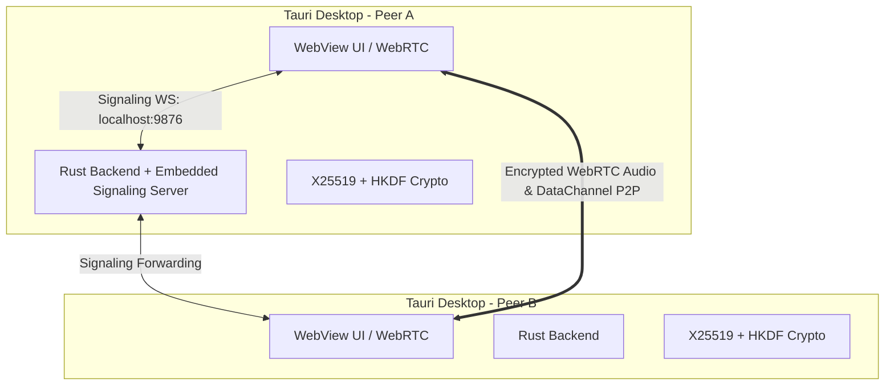

# NEIA 🎙️🔐

> **Secure, Anonymous, Peer-to-Peer Desktop Voice Chat Application**

NEIA is an open-source, lightweight desktop voice and text chat application designed from the ground up for maximum privacy, security, and ease of use. It requires **no accounts**, **no central media servers**, and **no registration**.

---

## ✨ Features

- **🔒 Zero Account Requirement**: Simply pick a session nickname and create or join a room.
- **🌐 Pure WebRTC Mesh (P2P)**: Audio streams connect directly peer-to-peer with no intermediary media server storing or relaying your voice.
- **⚡ Embedded Signaling Server**: Built-in zero-config Rust WebSocket signaling server runs directly inside the Tauri process (`127.0.0.1:9876`).
- **🔑 End-to-End Key Verification**: X25519 + HKDF-SHA256 crypto session keys with Signal-style 6-digit Safety Number verification (`XXX-XXX`) to protect against MITM attacks.
- **🎙️ Real-time Voice Activity Detection (VAD)**: Web Audio API RMS visual indicators highlighting active speakers in real time.
- **💬 Encrypted Text Chat**: Secure WebRTC DataChannel text messaging alongside high-fidelity voice channels.
- **🔗 Room Codes & Invite Links**: Instantly create rooms with 6-character non-ambiguous codes (e.g. `ABC123`) or shareable URL links.
- **🛡️ Formal Cybersecurity Risk Matrix**: Comprehensive threat model, attack vector analysis, and mitigations documented in [docs/SECURITY_RISK_MATRIX.md](file:///c:/Users/andre/Documents/VSC%20Projects/neia-project/docs/SECURITY_RISK_MATRIX.md).

---

## 🛠️ Architecture



---

## 🚀 Tech Stack

- **Desktop Framework**: [Tauri v2](https://tauri.app/) (Rust + Webview)
- **Frontend**: Vanilla HTML5, CSS3, JavaScript ES Modules, [Vite](https://vitejs.dev/)
- **Networking**: WebRTC (`RTCPeerConnection`, `RTCDataChannel`), WebSockets (`tokio-tungstenite`)
- **Cryptography**: `x25519-dalek`, `hkdf`, `sha2`, `aes-gcm`

---

## 💻 Getting Started

### Prerequisites

- [Node.js](https://nodejs.org/) (v18+ recommended)
- [Rust](https://www.rust-lang.org/) (latest stable toolchain)
- Tauri v2 prerequisites for your OS (Windows C++ Build Tools / Linux WebKitGTK / macOS Xcode Command Line Tools)

### Installation & Run

1. **Clone the repository**:
   ```bash
   git clone https://github.com/Cliptap/neia.git
   cd neia
   ```

2. **Install dependencies**:
   ```bash
   npm install
   ```

3. **Run in Development Mode**:
   ```bash
   npx tauri dev
   ```

4. **Build Production Bundle**:
   ```bash
   npx tauri build
   ```

---

## 🔐 Security & Privacy

NEIA operates on a strict zero-trust model:
- **No Persistence**: Nicknames and room states exist only in memory during the active session.
- **Direct P2P**: Audio packets are transmitted directly between participants via WebRTC DTLS-SRTP.
- **Safety Fingerprints**: Verify peer identities in person or via trusted out-of-band channels using the 6-digit key verification fingerprint modal.

---

## 📄 License

MIT License. See `LICENSE` for details.
